# Component Hierarchy and Data-Test Attributes

Voici un schéma Mermaid qui représente les composants et les hiérarchies des attributs data-test pour le composant `ThreeItemGrid`.

```mermaid
%%{init: {'theme': 'dark'}}%%

graph TD

%% Utilisation d'un vert plus foncé (#339966) avec du texte blanc (#fff) pour améliorer le contraste
classDef grid-item-class fill:#339966,stroke:#aaa,stroke-width:2px,color:#fff;

%% Bleu foncé (#336699) avec texte blanc (#fff) pour les conteneurs
classDef container-class fill:#336699,stroke:#aaa,stroke-width:2px,color:#fff;

%% Rouge foncé (#cc3333) avec texte blanc (#fff) pour les composants React
classDef react-component-class fill:#cc3333,stroke:#aaa,stroke-width:2px,color:#fff;

%% Subgraph représentant la structure globale de la grille
subgraph ThreeItemGrid
    style ThreeItemGrid fill:#333,stroke:#aaa,stroke-width:2px;

    %% Grid Item avec taille configurable
    ThreeItemGridItem[⚛️ Three Item Grids]
    class ThreeItemGridItem react-component-class

    GridItem[🗂️ data-test: three-item-grid]
    ThreeItemGridItem --> GridItem
    class GridItem container-class

    GridItemSize[🔍 data-test: grid-item <br>⬛ full / ⬜ half]
    GridItem --> GridItemSize
    class GridItemSize grid-item-class

    %% Grid Product Link pour GridItemSize
    GridItemSize --> GridProductLink[🔍 data-test: grid-product-link]
    class GridProductLink grid-item-class

    GridProductLink --> GridTileImage[⚛️ GridTileImage]
    class GridTileImage react-component-class

    GridTileImage --> GridTileContainer[🗂️ data-test: grid-tile-container]
    class GridTileContainer container-class

    GridTileContainer --> GridTileImageItem[🔍 data-test: grid-tile-image]
    class GridTileImageItem grid-item-class

    GridTileContainer --> Label[⚛️ Label]
    class Label react-component-class

    Label --> LabelContainer[🗂️ data-test: label-container]
    class LabelContainer container-class

    LabelContainer --> LabelContentWrapper[🗂️ data-test: label-content-wrapper]
    class LabelContentWrapper container-class

    LabelContentWrapper --> LabelTitleText[🔍 data-test: label-title-text]
    class LabelTitleText grid-item-class

    LabelContentWrapper --> Price[⚛️ Price]
    class Price react-component-class

    Price --> PriceAmount[🔍 data-test: price-amount]
    class PriceAmount grid-item-class

    Price --> PriceCurrencyCode[🔍 data-test: price-currency-code]
    class PriceCurrencyCode grid-item-class
end

%% Subgraph pour la légende
subgraph Légende
    direction LR
    ReactComp[⚛️ Composants React]
    class ReactComp react-component-class

    DataTestCont[🗂️ Conteneur data-test]
    class DataTestCont container-class

    TestableElem[🔍 Éléments testables]
    class TestableElem grid-item-class
end

```

[![](https://mermaid.ink/img/pako:eNqVVs1u20YQfpUFA0ENIKaWlcoWWwRo5aII4ACBraJAKx9W5FBaeLlLLJeJHUGX3nooeilQoCnQs4E8QO96E79A-wid3RUp_oh2woNE7sx837czQ-6svVBG4AVer7dmgumArPt6BQn0A9KPqLrubza93lzMxVLRdEVmZ-a-1yPfa8ZZRjWTgkT9XJA3oDRJeZ6RWIpwe0c-ezIaTSbj8VNC30BIopxouNFAFpyKEK1xHD8lqcwVocn2jjOpQBEOJJRCK5ppmIuQ0yw7g5gsFYt8piHx7RKJGefBDn-QaSWvIXhCKd3d-29ZpFfBcXozCCWXKjBkX-6Uf8Mhr2ocjyeTncYugRwyKwsE5Cqr6DKLlAlQDV0G81N1Xch8CXthYTjC66OEJanMqNAZuQAa6oo8ZZ596yBA6JpIh_-pIi_zhWsEBana3mWIisyEU4LBeahzBWTJ5YJiISMw61g6zrGWWRE5WymAl1jL77Coc0HwyvQt-tcMZSoflmh1GQjUZsNM_C5n1BCbEsVsmSu6MCqMa43H_P90_-f7f__5zRkcgjFlV87fZa0VdTi7LsT9lvj__f3Hz4Ygopr6GjJ8zbSBcy1tmvuqQxrx_RclTlVO6dBowUP8l-wdoIbff60KKF8p8tVCvbj_8J7EOefkc3L_4S-yojy-qoPUlBjEQ2rMevNlbVbotZIRdgo5Z-LadXEbtYZXEO8CTdzh3aTOwefocdWUV4nuUth0K4hnjMPLhC6haJTaYouptHxch-zdq3zToqyHmsfqxw8w-GX1D6ooQdpdUuffO7b2vGvgA-m2AtjDKbCd80C62-TndAG8SLR9qKHblccT69xKvAezyY1HRybr0V1pbHjVaFHeD_jdSx_jNtt46xwPK9gDPSqj4lpqmTHNYYbnSKuYToM2dt8cNG36MrarlF3MrxULy7fGPtTA7crjxXRuJd7XicxFexupsfnUGtssLqhLf4NhmisFIryd4mzUwRPuXHwzP7XpqghtUhBR8zx1xzklfHu3RHP1wDwvlwxJxBSEduw6v3Ar9tSfYvqKRE8bE0FNXundlXfnfIYbnuF-TVHLxp0WM9A-HzXsalBXkxq7OYu_5cV3ZfsLbjoBI1fvjI2jtxLSkUxv4CWgEsoinGXXJnju2Tl27gV4i5pxpuRzby426EpzLS9vRegFOLTAwFM4eq28IKY8w6c8xd3BGaOY_qRcTan4UcqkCIGIaaleueHZztDWxQvW3o0XHB-Nnx0_H05Ono-GJ6fDk4F36wVHm4H3zkIMnx25a3h8OpycfjEab_4HDOwk4w?type=png)](https://mermaid-js.github.io/mermaid-live-editor/edit#pako:eNqVVs1u20YQfpUFA0ENIKaWlcoWWwRo5aII4ACBraJAKx9W5FBaeLlLLJeJHUGX3nooeilQoCnQs4E8QO96E79A-wid3RUp_oh2woNE7sx837czQ-6svVBG4AVer7dmgumArPt6BQn0A9KPqLrubza93lzMxVLRdEVmZ-a-1yPfa8ZZRjWTgkT9XJA3oDRJeZ6RWIpwe0c-ezIaTSbj8VNC30BIopxouNFAFpyKEK1xHD8lqcwVocn2jjOpQBEOJJRCK5ppmIuQ0yw7g5gsFYt8piHx7RKJGefBDn-QaSWvIXhCKd3d-29ZpFfBcXozCCWXKjBkX-6Uf8Mhr2ocjyeTncYugRwyKwsE5Cqr6DKLlAlQDV0G81N1Xch8CXthYTjC66OEJanMqNAZuQAa6oo8ZZ596yBA6JpIh_-pIi_zhWsEBana3mWIisyEU4LBeahzBWTJ5YJiISMw61g6zrGWWRE5WymAl1jL77Coc0HwyvQt-tcMZSoflmh1GQjUZsNM_C5n1BCbEsVsmSu6MCqMa43H_P90_-f7f__5zRkcgjFlV87fZa0VdTi7LsT9lvj__f3Hz4Ygopr6GjJ8zbSBcy1tmvuqQxrx_RclTlVO6dBowUP8l-wdoIbff60KKF8p8tVCvbj_8J7EOefkc3L_4S-yojy-qoPUlBjEQ2rMevNlbVbotZIRdgo5Z-LadXEbtYZXEO8CTdzh3aTOwefocdWUV4nuUth0K4hnjMPLhC6haJTaYouptHxch-zdq3zToqyHmsfqxw8w-GX1D6ooQdpdUuffO7b2vGvgA-m2AtjDKbCd80C62-TndAG8SLR9qKHblccT69xKvAezyY1HRybr0V1pbHjVaFHeD_jdSx_jNtt46xwPK9gDPSqj4lpqmTHNYYbnSKuYToM2dt8cNG36MrarlF3MrxULy7fGPtTA7crjxXRuJd7XicxFexupsfnUGtssLqhLf4NhmisFIryd4mzUwRPuXHwzP7XpqghtUhBR8zx1xzklfHu3RHP1wDwvlwxJxBSEduw6v3Ar9tSfYvqKRE8bE0FNXundlXfnfIYbnuF-TVHLxp0WM9A-HzXsalBXkxq7OYu_5cV3ZfsLbjoBI1fvjI2jtxLSkUxv4CWgEsoinGXXJnju2Tl27gV4i5pxpuRzby426EpzLS9vRegFOLTAwFM4eq28IKY8w6c8xd3BGaOY_qRcTan4UcqkCIGIaaleueHZztDWxQvW3o0XHB-Nnx0_H05Ono-GJ6fDk4F36wVHm4H3zkIMnx25a3h8OpycfjEab_4HDOwk4w)
