# Conception des Tests

## Hiérarchie des Composants et Attributs Data-Test

### Home page

#### ThreeItemGrid Component

Voici un schéma Mermaid qui représente les composants et les hiérarchies des attributs data-test pour le composant `ThreeItemGrid`.

```mermaid
%%{init: {'theme': 'dark'}}%%

graph TD

%% Using a darker green (#339966) with white text (#fff) for better contrast
classDef grid-item-class fill:#339966,stroke:#aaa,stroke-width:2px,color:#fff;

%% Dark blue (#336699) with white text (#fff) for containers
classDef container-class fill:#336699,stroke:#aaa,stroke-width:2px,color:#fff;

%% Dark red (#cc3333) with white text (#fff) for React components
classDef react-component-class fill:#cc3333,stroke:#aaa,stroke-width:2px,color:#fff;

%% Subgraph representing the overall grid structure
subgraph ThreeItemGrid
    style ThreeItemGrid fill:#333,stroke:#aaa,stroke-width:2px;

    %% Grid Item with configurable size
    ThreeItemGridItem[⚛️ Three Item Grids]
    class ThreeItemGridItem react-component-class

    GridItem[🗂️ data-test: three-item-grid]
    ThreeItemGridItem --> GridItem
    class GridItem container-class

    GridItemSize[🔍 data-test: grid-item <br>⬛ full / ⬜ half]
    GridItem --> GridItemSize
    class GridItemSize grid-item-class

    %% Grid Product Link for GridItemSize
    GridItemSize --> GridProductLink[🔍 data-test: grid-product-link]
    class GridProductLink grid-item-class

    GridProductLink --> GridTileImage[⚛️ GridTileImage]
    class GridTileImage react-component-class

    GridTileImage --> GridTileContainer[🗂️ data-test: grid-tile-container]
    class GridTileContainer container-class

    GridTileContainer --> GridTileImageItem[🔍 data-test: grid-tile-image]
    class GridTileImageItem grid-item-class

    GridTileContainer --> Label[⚛️ Label]
    class Label react-component-class

    Label --> LabelContainer[🗂️ data-test: label-container]
    class LabelContainer container-class

    LabelContainer --> LabelContentWrapper[🗂️ data-test: label-content-wrapper]
    class LabelContentWrapper container-class

    LabelContentWrapper --> LabelTitleText[🔍 data-test: label-title-text]
    class LabelTitleText grid-item-class

    LabelContentWrapper --> Price[⚛️ Price]
    class Price react-component-class

    Price --> PriceAmount[🔍 data-test: price-amount]
    class PriceAmount grid-item-class

    PriceAmount --> PriceCurrencyCode[🔍 data-test: price-currency-code]
    class PriceCurrencyCode grid-item-class
end

%% Adding explanatory notes as special nodes
Note1[Note: This component represents a set of products displayed in a grid format.]
Note2[Note: This is the main container of the grid that encompasses all product elements.]
Note3["Note: Defines the size of the item in the grid. Two sizes are possible:
⬛ full or ⬜ half."]
Note4[Note: Link to the specific product detail page.]
Note5[Note: Component that displays the main image of the product in the grid.]
Note6[Note: Container for the product image, labels, and other information.]
Note7[Note: Component to display the textual information of the product, such as the title and price.]
Note8[Note: Displays the product name in the grid.]
Note9[Note: Displays the product price amount with the currency.]

ThreeItemGridItem --> Note1
GridItem --> Note2
GridItemSize --> Note3
GridProductLink --> Note4
GridTileImage --> Note5
GridTileContainer --> Note6
Label --> Note7
LabelTitleText --> Note8
PriceAmount --> Note9
```

[![Grid Product Display](https://mermaid.ink/img/pako:eNqdV92K4zYUfhXhJUwX4rTO3yZuWVhmoCzslqWTUuh4LhRbTsTYkpHkzmSHuel92ZuFQrfQF9gH6PPMC7SP0CPJVvyTZGiHYSbROef7Pp1zrCPfezFPiBd6g8E9ZVSF6P5MbUlOzkJ0lmBxc_bwMBhELGIbgYstWl3oz4MB-kFStkEYaR8i0EYQwtAXzyaT5XI-f45uqdqi2y1VBClyp8CSpulzlHKB1kQpiIg5UwJLFbE4w1JekBRAaOJDSO6bJZTSLAsryKFUgt-Q8BnGuPrs39JEbcNxcTeMecZFqDm-rvRdgC60zkpiRM3ny-VJUVoNpowI2dDjFjt6NNr_0iNIAqRxPIGfk3K-JzhWwJ8XnBGmmqKENvnO1JJmkf-rtMtybYsrSCGIBFBdWugCxH8mAmeZKQwCpDJWpSARk3XEagt1fw0V-xY8IobgR6pdRtoGl7jT0oweDQGaTJiOt1mCSqR0Uwq8BmxJ3xPr2GLR_68ef__0918frMHGa5O8tv42V72owzmt1Tjsf_787RcNnmCFfUUkPCxKQ9mW1Tm6PiIL-f5Lh9OU4hw6rdblvoQtA__HX5vk7nFB36zFy8fPn1BaQrG-RI-f_0BbnKXXbZCWikuXxLYSvd59ELt1eSd4Aq2A3lB2Y9q1D9qCq3mrOB12eDOFdfAz8LjuqmtEHxPYdauJVzQjr3O8IXV_tBZ7TM7ydGPsXZtc53U1D_WM0a7Ay3dFP6jAgZxqjrZjb79V3x5ItRFAT2_fNM2JVPfJ3-A1yeokmy8tdLNyOqnWxWGdzGSmPY5ksR19LIUdrxYtSPsRDrniKW69hVvreFjBHuhJGQ1Xp2VFVUZWMCB6hbQalLb7eoL06V3ssTIeY34naOyeFvOlBW5WThfSujisVzkvWX8Lhbb52Bj7DDbomPami-M5L4UgLN6dw7XmCFtcufj66tMnbSL0qQlLqrH5Kkn0nCR3RYYZVlzsEOPAg7BEsiAxxRksJASCvoP14Er_DWE4ULmf7PuZC3FIEoV4iqpjUKKESgDfwa2BMjCbMQznbY7V6Nqijpuo8Kundg4dtu80DahXTbDaYoVgc0APu9FaYWBUdIhkcO8DITX25CryLDrcOwDKouvpW2Oa4QNkNf4IrW658QBkQVDBpaQwskPkphNMi3o8jSKvYppWuzCHtuKWR6cwpbGTlxDYEKiFg6lWOKvizl06zQartDWyYQ66WnUN2BReAc4dYJ09Pd5aQRppaB89OUSYJYiDXQCarQzlrEZ70ZfHa3EGVD-0JbRJI7YjcohkGW91Sxl__TgbTtPJNc-i4rlo7rsWzHBODm11eSrIwCP7WNobmLbWD46GiNjhW45p9Yj11sb7NXcnME1m17tT23SFNbVHrCn73tA-u00JI7afIaYK1cL-LKwti4h1zxCTGW_o5QTqQRN4MbrXB0TkmZeiyAvhIyMlvLlkkRexB3DFpeKXOxZ7IVyQydATvNxsvTDFmYRvZQHnD7mgGC7MuVstMPuJ87wOIQmF8-OtfRMzL2TGxQvvvTsvnM1HwXwcTCazxXQ8nwXjobfzwmA8G71YLMdfzaaz6XQ5DsYPQ--9AQ1GwXKynC4XwWIeBMF09vAvo7n2MQ?type=png)](https://mermaid-js.github.io/mermaid-live-editor/edit#pako:eNqdV92K4zYUfhXhJUwX4rTO3yZuWVhmoCzslqWTUuh4LhRbTsTYkpHkzmSHuel92ZuFQrfQF9gH6PPMC7SP0CPJVvyTZGiHYSbROef7Pp1zrCPfezFPiBd6g8E9ZVSF6P5MbUlOzkJ0lmBxc_bwMBhELGIbgYstWl3oz4MB-kFStkEYaR8i0EYQwtAXzyaT5XI-f45uqdqi2y1VBClyp8CSpulzlHKB1kQpiIg5UwJLFbE4w1JekBRAaOJDSO6bJZTSLAsryKFUgt-Q8BnGuPrs39JEbcNxcTeMecZFqDm-rvRdgC60zkpiRM3ny-VJUVoNpowI2dDjFjt6NNr_0iNIAqRxPIGfk3K-JzhWwJ8XnBGmmqKENvnO1JJmkf-rtMtybYsrSCGIBFBdWugCxH8mAmeZKQwCpDJWpSARk3XEagt1fw0V-xY8IobgR6pdRtoGl7jT0oweDQGaTJiOt1mCSqR0Uwq8BmxJ3xPr2GLR_68ef__0918frMHGa5O8tv42V72owzmt1Tjsf_787RcNnmCFfUUkPCxKQ9mW1Tm6PiIL-f5Lh9OU4hw6rdblvoQtA__HX5vk7nFB36zFy8fPn1BaQrG-RI-f_0BbnKXXbZCWikuXxLYSvd59ELt1eSd4Aq2A3lB2Y9q1D9qCq3mrOB12eDOFdfAz8LjuqmtEHxPYdauJVzQjr3O8IXV_tBZ7TM7ydGPsXZtc53U1D_WM0a7Ay3dFP6jAgZxqjrZjb79V3x5ItRFAT2_fNM2JVPfJ3-A1yeokmy8tdLNyOqnWxWGdzGSmPY5ksR19LIUdrxYtSPsRDrniKW69hVvreFjBHuhJGQ1Xp2VFVUZWMCB6hbQalLb7eoL06V3ssTIeY34naOyeFvOlBW5WThfSujisVzkvWX8Lhbb52Bj7DDbomPami-M5L4UgLN6dw7XmCFtcufj66tMnbSL0qQlLqrH5Kkn0nCR3RYYZVlzsEOPAg7BEsiAxxRksJASCvoP14Er_DWE4ULmf7PuZC3FIEoV4iqpjUKKESgDfwa2BMjCbMQznbY7V6Nqijpuo8Kundg4dtu80DahXTbDaYoVgc0APu9FaYWBUdIhkcO8DITX25CryLDrcOwDKouvpW2Oa4QNkNf4IrW658QBkQVDBpaQwskPkphNMi3o8jSKvYppWuzCHtuKWR6cwpbGTlxDYEKiFg6lWOKvizl06zQartDWyYQ66WnUN2BReAc4dYJ09Pd5aQRppaB89OUSYJYiDXQCarQzlrEZ70ZfHa3EGVD-0JbRJI7YjcohkGW91Sxl__TgbTtPJNc-i4rlo7rsWzHBODm11eSrIwCP7WNobmLbWD46GiNjhW45p9Yj11sb7NXcnME1m17tT23SFNbVHrCn73tA-u00JI7afIaYK1cL-LKwti4h1zxCTGW_o5QTqQRN4MbrXB0TkmZeiyAvhIyMlvLlkkRexB3DFpeKXOxZ7IVyQydATvNxsvTDFmYRvZQHnD7mgGC7MuVstMPuJ87wOIQmF8-OtfRMzL2TGxQvvvTsvnM1HwXwcTCazxXQ8nwXjobfzwmA8G71YLMdfzaaz6XQ5DsYPQ--9AQ1GwXKynC4XwWIeBMF09vAvo7n2MQ)
